# Tree Diagram — The Daily Reflection Tree

```mermaid
flowchart TD
    START([🌙 START\nGood evening...]) --> A0_OPEN

    A0_OPEN{A0_OPEN\nOne word for today?} -->|Productive / Steady| A0_D1_H
    A0_OPEN -->|Frustrating / Draining / Chaotic| A0_D1_L

    A0_D1_H[ ] --> A1_Q1_HIGH
    A0_D1_L[ ] --> A1_Q1_LOW

    A1_Q1_HIGH{A1_Q1_HIGH\nWhat made it go well?} -->|Prepared / Adapted\ninternal ×1| A1_Q2
    A1_Q1_HIGH -->|Team / Luck\nexternal ×1| A1_Q2

    A1_Q1_LOW{A1_Q1_LOW\nFirst instinct\nwhen difficult?} -->|Control / Push through\ninternal ×1| A1_Q2
    A1_Q1_LOW -->|Wait / Stuck\nexternal ×1| A1_Q2

    A1_Q2{A1_Q2\nWhen plans changed,\nwhat did you do?} -->|Asked self / Workaround\ninternal ×1| A1_D2
    A1_Q2 -->|Frustrated / Needed someone\nexternal ×1| A1_D2

    A1_D2{Decision:\naxis1 tally} -->|internal ≥ external| A1_R_INTERNAL
    A1_D2 -->|external > internal| A1_R_EXTERNAL

    A1_R_INTERNAL[/💡 REFLECTION\nYou see your\nagency today/] --> BRIDGE_1_2
    A1_R_EXTERNAL[/💡 REFLECTION\nHard days pull\nattention outward/] --> BRIDGE_1_2

    BRIDGE_1_2[[🔗 BRIDGE 1→2\nFrom how you moved,\nto what you gave]] --> A2_OPEN

    A2_OPEN{A2_OPEN\nOne interaction\ntoday?} -->|Helped / Taught\ncontrib ×1| A2_Q2
    A2_OPEN -->|Recognition / Frustrated\nentitle ×1| A2_Q2

    A2_Q2{A2_Q2\nEnd of day thought?} -->|Give / Team\ncontrib ×1| A2_Q3
    A2_Q2 -->|Noticed / Credit\nentitle ×1| A2_Q3

    A2_Q3{A2_Q3\nWent beyond\nwhat was asked?} -->|Yes naturally / Wanted to\ncontrib ×1| A2_D1
    A2_Q3 -->|Hoped noticed / Stuck to expected\nentitle ×1| A2_D1

    A2_D1{Decision:\naxis2 tally} -->|contribution ≥ entitlement| A2_R_CONTRIBUTION
    A2_D1 -->|entitlement > contribution| A2_R_ENTITLEMENT

    A2_R_CONTRIBUTION[/💡 REFLECTION\nToday your attention\nwent outward/] --> BRIDGE_2_3
    A2_R_ENTITLEMENT[/💡 REFLECTION\nIt is human\nto keep score/] --> BRIDGE_2_3

    BRIDGE_2_3[[🔗 BRIDGE 2→3\nFrom what you gave,\nto what it meant to others]] --> A3_OPEN

    A3_OPEN{A3_OPEN\nWho comes to mind\nfor today's challenge?} -->|Team / Colleague / Customer\naltro ×1| A3_Q2
    A3_OPEN -->|Just me\nself ×1| A3_Q2

    A3_Q2{A3_Q2\nCheck in with\nanyone today?} -->|Yes\naltro ×1| A3_Q3
    A3_Q2 -->|No / Thought about it\nself ×1| A3_Q3

    A3_Q3{A3_Q3\nImpact of\nyour work today?} -->|Team / Customer\naltro ×1| A3_D1
    A3_Q3 -->|My deliverables / Don't think about it\nself ×1| A3_D1

    A3_D1{Decision:\naxis3 tally} -->|altrocentric ≥ self| A3_R_ALTROCENTRIC
    A3_D1 -->|self > altrocentric| A3_R_SELF

    A3_R_ALTROCENTRIC[/💡 REFLECTION\nYour radius extended\nbeyond yourself/] --> SUMMARY
    A3_R_SELF[/💡 REFLECTION\nAttention stayed\nclose to home/] --> SUMMARY

    SUMMARY[📋 SUMMARY\nThree lenses: Agency\nContribution + Radius] --> END
    END([✨ END\nSee you tomorrow.])

    style START fill:#2d3748,color:#fff
    style END fill:#2d3748,color:#fff
    style BRIDGE_1_2 fill:#553c9a,color:#fff
    style BRIDGE_2_3 fill:#553c9a,color:#fff
    style A1_R_INTERNAL fill:#276749,color:#fff
    style A1_R_EXTERNAL fill:#276749,color:#fff
    style A2_R_CONTRIBUTION fill:#276749,color:#fff
    style A2_R_ENTITLEMENT fill:#276749,color:#fff
    style A3_R_ALTROCENTRIC fill:#276749,color:#fff
    style A3_R_SELF fill:#276749,color:#fff
    style SUMMARY fill:#744210,color:#fff
    style A1_D2 fill:#1a365d,color:#fff
    style A2_D1 fill:#1a365d,color:#fff
    style A3_D1 fill:#1a365d,color:#fff
    style A0_D1_H fill:#e2e8f0
    style A0_D1_L fill:#e2e8f0
```

## Legend

| Shape | Meaning |
|-------|---------|
| Rounded rectangle | start / end |
| Diamond `{}` | question or decision node |
| Double bracket `[[]]` | bridge node |
| Parallelogram `/  /` | reflection node |
| Rectangle | summary node |

## Key Branching Points

1. **A0_D1** — Routes to `A1_Q1_HIGH` (positive day) or `A1_Q1_LOW` (negative day). First question adapts to the employee's initial emotional frame.
2. **A1_D2** — Tallies Axis 1 signals across 2 questions. Majority wins.
3. **A2_D1** — Tallies Axis 2 signals across 3 questions. Majority wins.
4. **A3_D1** — Tallies Axis 3 signals across 3 questions. Majority wins.

## Possible Paths Through the Tree

There are **2 × 2 × 2 = 8** distinct reflection combinations (one per axis × 3 axes), reached via one of two entry paths (HIGH/LOW) on Axis 1. In total, the tree supports **16 unique conversational paths** from START to END.
